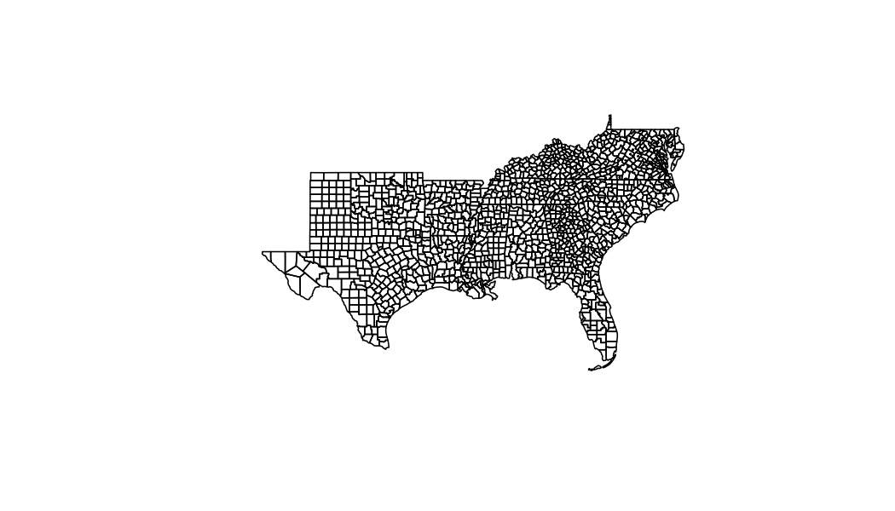
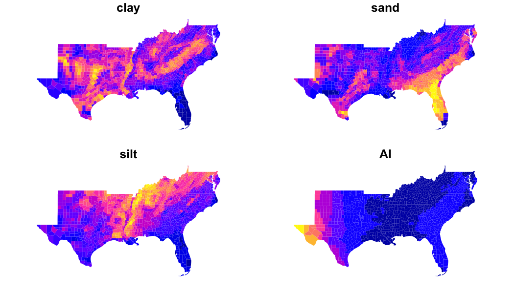

# Define Area of Interest and Aggregation Units



# Find cached geogrids 


```r
cache = geo_cache_list()

ai_norm = cache %>% 
  filter(grepl('ai_normal', fullname)) %>% 
  pull(fullname)

soil_files = cache %>% 
  filter(grepl('silt-1m-percent.tif', fullname)) %>% 
  pull(fullname)
```

# Disparate Grids 😢


```r
make_grid(ai_norm)
```

```
## $ext
## [1] -124.79   25.05  -67.04   49.42
## 
## $dimXY
## [1] 1386  585
## 
## $resXY
## [1] 0.04167 0.04167
## 
## $prj
## [1] "+proj=longlat +datum=WGS84 +no_defs"
```

```r
make_grid(soil_files)
```

```
## $ext
## [1] -2357000   277000  2259000  3173000
## 
## $dimXY
## [1] 4616 2896
## 
## $resXY
## [1] 1000 1000
## 
## $prj
## [1] "+proj=aea +lat_0=23 +lon_0=-96 +lat_1=29.5 +lat_2=45.5 +x_0=0 +y_0=0 +datum=NAD27 +units=m +no_defs"
```

# Warp AI to soils and execute Zonal


```r
system.time({
  out   = geogrid_warp(ai_norm, make_grid(soil_files[1]), disk = TRUE)
  sta   = terra::rast(c(out, soil_files))
  oo    = execute_zonal(sta, AOI, "geoid")
})
```

```
##    user  system elapsed 
##   8.439   1.916  10.894
```

```r
head(oo)
```

```
##    geoid     V1     V2
## 1: 01001 0.9602 0.2573
## 2: 01003 0.8641 0.2383
## 3: 01005 1.0199 0.2043
## 4: 01007 0.9078 0.3181
## 5: 01009 0.8451 0.3371
## 6: 01011 0.9868 0.2654
```

```r
w = weighting_grid(sta, AOI, "geoid")

new = cache %>% 
  filter(grepl('silt-1m-percent.tif|sand-1m-percent.tif|clay-1m-percent.tif', fullname)) 

sta = 
system.time({
  oo    = execute_zonal(c(new$fullname, out), w = w,)
})


oo=setNames(oo, c("geoid", "clay", "sand", "silt", "AI"))

head(oo)
```

```
##    geoid   clay   sand   silt     AI
## 1: 01001 0.2060 0.5359 0.2573 0.9602
## 2: 01003 0.1714 0.5416 0.2383 0.8641
## 3: 01005 0.1687 0.6074 0.2043 1.0199
## 4: 01007 0.2245 0.3724 0.3181 0.9078
## 5: 01009 0.1670 0.2545 0.3371 0.8451
## 6: 01011 0.2658 0.4679 0.2654 0.9868
```

# Results




