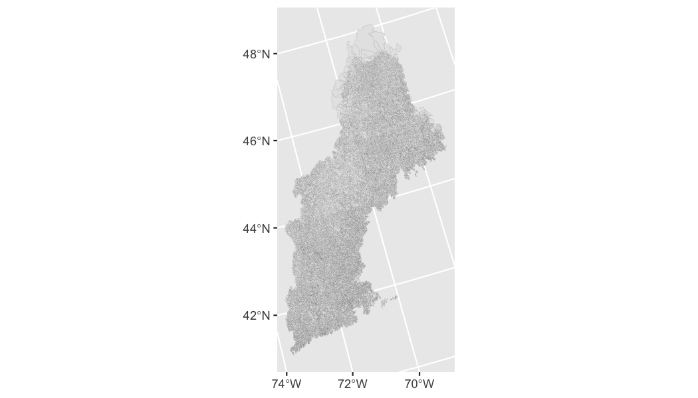
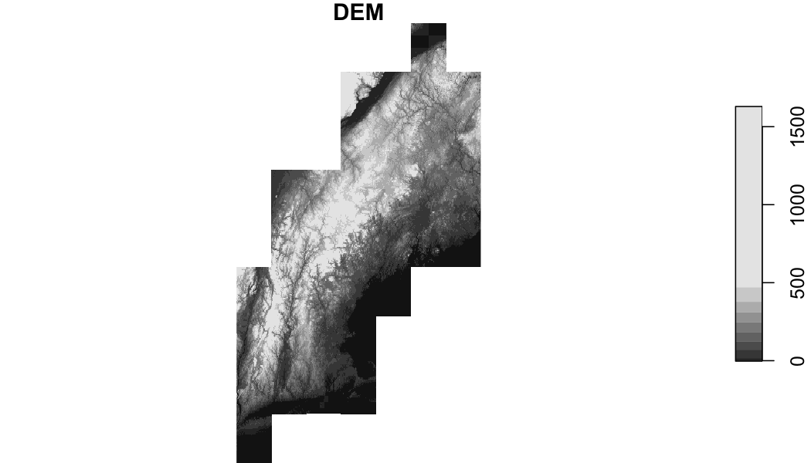

## Define AOI


```r
library(sf)
library(stars)
library(geogrids)
library(ggplot2)

geom <- read_sf("hydrofabric.gpkg", "catchments") 

ggplot(geom) + 
  geom_sf(size = .01)
```



## Find, cache/download, Merge, and Plot DEM data


```r
# Identify needed NED tiles
files   = get_ned(geom, res = "1")
# Define location to write merged raster
tmpfile = tempfile(fileext = '.tif')

# Merge NED tiles into tempfile
merge_rasters(files, tmpfile)

# plot data!
plot(read_stars(tmpfile), main = "DEM")
```

```
## downsample set to c(75)
```




