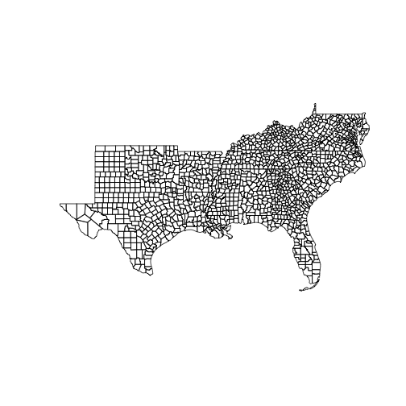
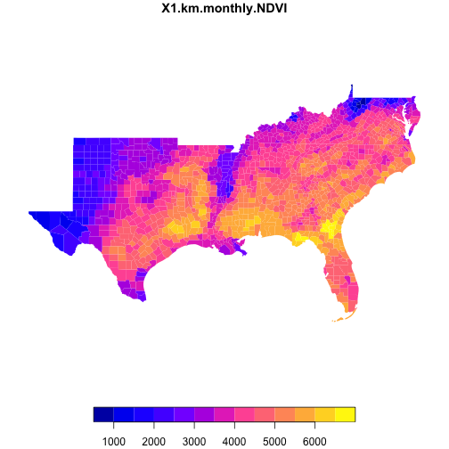

```r
library(zonal)
library(geogrids)
library(dplyr)
```

# Define Area of Interest and Aggregation Units

```r
base  = geo_path()
AOI   = AOI::aoi_get(state = "south", county = "all")
plot(AOI$geometry)
```



# Find cached geogrids 

```r
lai_files = geo_cache_list() %>% 
  filter(grepl('MOD13A3.006/conus', fullname)) %>% 
  pull(fullname)

soil_files = geo_cache_list() %>% 
  filter(grepl('silt-1m-percent.tif', fullname)) %>% 
  pull(fullname)
```

# Disparate Grids 😢

```r
make_grid(lai_files[1])
#> $ext
#> [1] -124.78750   25.04583  -67.03750   49.42083
#> 
#> $dimXY
#> [1] 1386  585
#> 
#> $resXY
#> [1] 0.04166667 0.04166667
#> 
#> $prj
#> [1] "+proj=longlat +ellps=WGS84 +no_defs"
make_grid(soil_files[1])
#> $ext
#> [1] -2357000   277000  2259000  3173000
#> 
#> $dimXY
#> [1] 4616 2896
#> 
#> $resXY
#> [1] 1000 1000
#> 
#> $prj
#> [1] "+proj=aea +lat_0=23 +lon_0=-96 +lat_1=29.5 +lat_2=45.5 +x_0=0 +y_0=0 +datum=NAD27 +units=m +no_defs"
```

# Warp LAI to soils and execute Zonal

```r
system.time({
  out   = geogrid_warp(lai_files[1], make_grid(soil_files[1]), disk = TRUE)
  w     = zonal::weighting_grid(out, AOI, "geoid")
  oo    = execute_zonal(out, w)
})
#>    user  system elapsed 
#>   6.776   0.716   7.584

head(oo)
#>    geoid X1.km.monthly.NDVI
#> 1: 01001           5116.209
#> 2: 01003           5603.188
#> 3: 01005           5230.946
#> 4: 01007           5585.465
#> 5: 01009           4811.954
#> 6: 01011           5269.783
```

# Speed with precomputed weights

```r
# Assuming the weight grid is precomputed...
system.time({
  out   = geogrid_warp(lai_files[1], make_grid(soil_files[1]), disk = TRUE)
  oo    = execute_zonal(out, w)
})
#>    user  system elapsed 
#>   1.693   0.270   2.627
```

# Results


```r
a = merge(AOI, oo)
plot(a['X1.km.monthly.NDVI'], border = FALSE)
```




