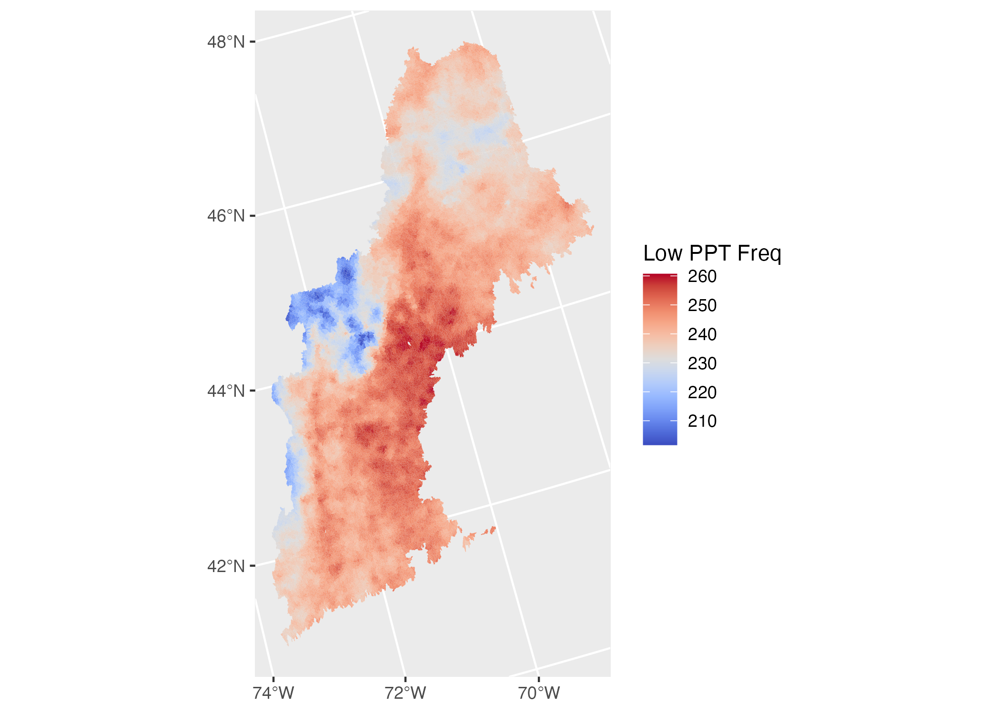
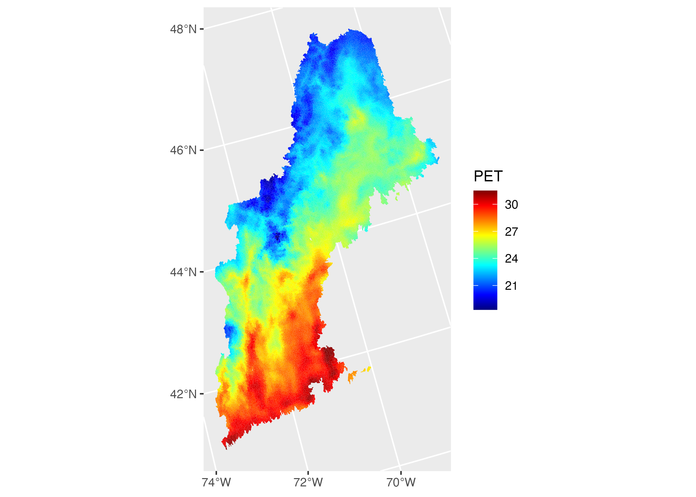
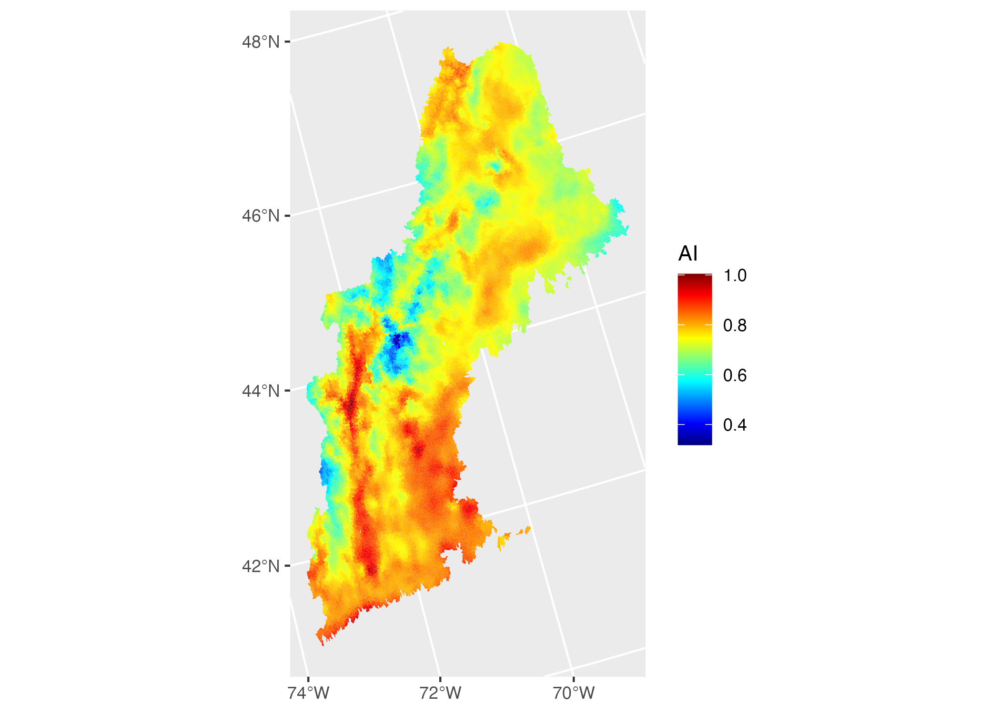
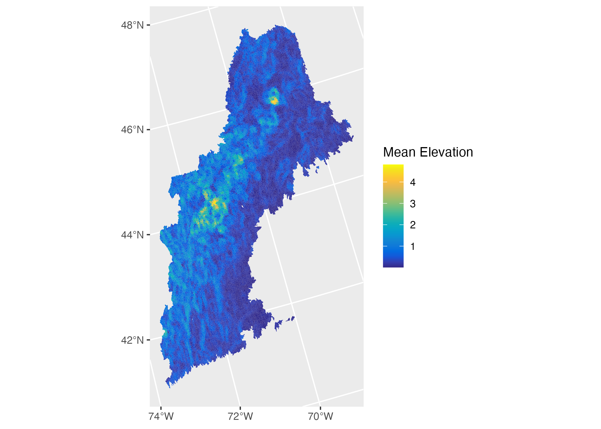
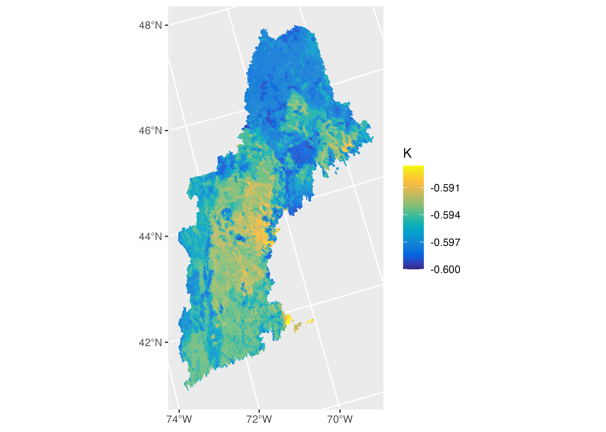
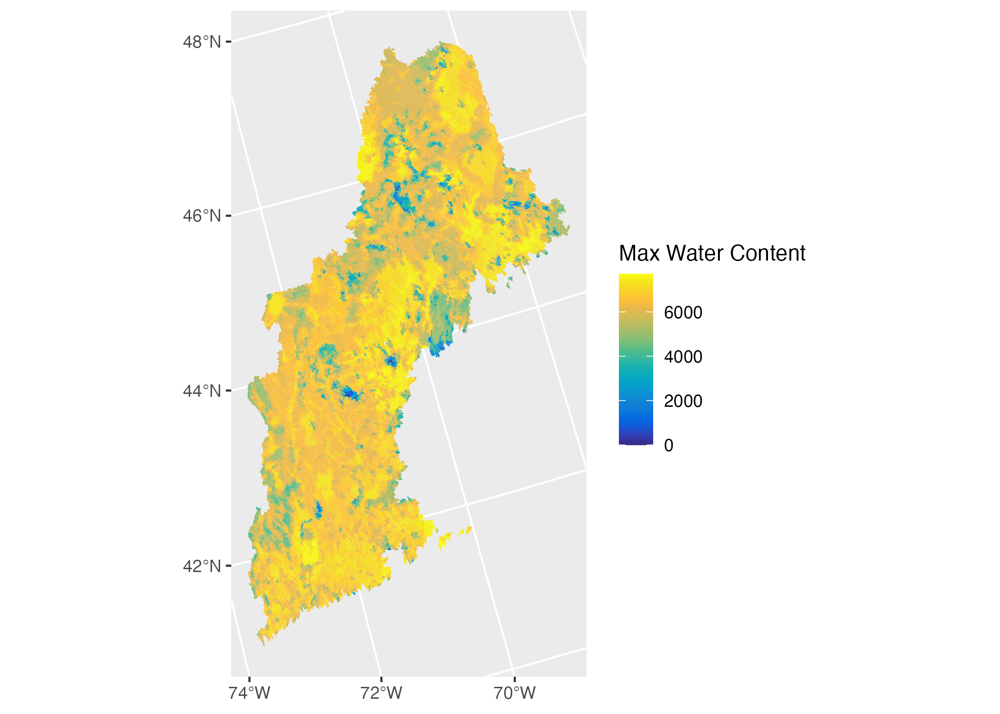
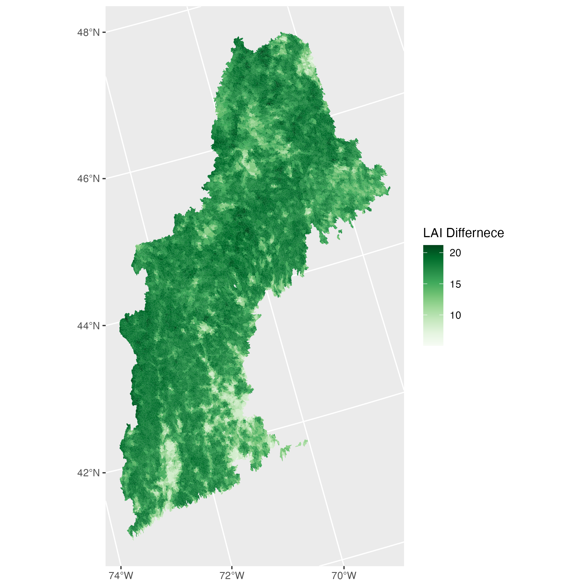

##  {.tabset .tabset-fade .tabset-pills}

### Rain {.tabset .tabset-fade}

#### **Mean precipitation**

> Mean daily precipitation (mm/day)

<span style="color:orange">We use daily GridMet files from 2018-2020.</span>.


```{r echo = FALSE, out.width="50%"}
knitr::include_graphics("img/meanPPT.png")
```

#### **Snowfall Fraction**

> Fraction of precipitation falling as snow

<span style="color:orange">We use the daily GridMet files for tmin_* and tmax_* to create tavg_*. We use a temperature threshold following Keith Jenning's [paper](https://www.nature.com/articles/s41467-018-03629-7) and the data found [here](https://datadryad.org/stash/dataset/doi:10.5061/dryad.c9h35). With this temperature threshold, we partition all PPT values into daily snow/rain. Total snow and precipitation are computed for each basin, and the fraction of Snow to PPT is computed. </span>

```{r echo = FALSE, out.width="50%"}
knitr::include_graphics("img/snowfrac.png")
```

#### **Seasonality**

> Seasonality and timing of precipitation (estimated using sine curves to represent the annual temperature and preciptiation cycles, positive [negative] values indicate that precipitation peaks in summer [winter], values close to 0 indicate uniform precipitation ([eq 14](https://www.sciencedirect.com/science/article/pii/S030917080900102X))

<span style="color:red">NOT SURE YET.</span>

#### **High Frequency**

> Frequency of high precipitation days (≥5 times mean daily precipitation) (days/year)

<span style="color:orange"> Basin wide meanPPT is multiplied by 5 and used to classify each day as "intense" (TRUE) or not (FALSE). The sum of "intense" days is computed for each basin and divided by the number of years processed</span>.

```{r echo = FALSE, out.width="50%"}
knitr::include_graphics("img/high_ppt_freq.png")
```

#### **Low Frequency**

> frequency of dry days (<1 mm/day) (days/year)

<span style="color:orange"> Daily PPT is defined as "low" (TRUE) or not (FALSE) based on if it is larger the 1mm.
The sum of "low" days is computed for each basin and divided by the number of years processed </span>.

```{r echo = FALSE, out.width="50%"}

```

#### **High Duration**

> average duration of high precipitation events (number of consecutive days ≥5 times mean daily precipitation) (days)

<span style="color:orange">The average duration of intense rain is computed by transposing the intense PPT TRUE/FALSE matrix and computing a cumulative sum for each catchment resetting the count with each `FALSE`. Only the max value in each intense period is kept and the rest set to NA. The mean for each catchment is computed. </span>.

```{r echo = FALSE, out.width="50%"}
knitr::include_graphics("img/high_dur_ppt.png")
```

#### **Low duration**

> average duration of dry periods (number of consecutive days <1 mm/day) (days)

<span style="color:orange">TThe average duration of low rain is computed by transposing the low PPT TRUE/FALSE matrix and computing a cumulative sum for each catchment resetting the count with each `FALSE`. Only the max value in each low period is kept and the rest set to NA. The mean for each catchment is computed. </span></span>.

```{r echo = FALSE, out.width="50%"}
knitr::include_graphics("img/low_dur_ppt.png")
```

### Energy {.tabset .tabset-fade}

#### **Mean PET**

> Mean daily PET (estimated by N15 using Priestley-Taylor formulation calibrated for each catchment)

<span style="color:orange">Mean daily PET is computed from the PET Gridment files. </span>.

```{r echo = FALSE, out.width="50%"}

```

#### **Aridity**

> Aridity (PET/P), ratio of mean PET to mean precipitation. Daily GridMet files for pet_* and pr_* from 2018-2020 are used to compute to annual mean PET and PPT.

<span style="color:orange">WAn aridity index is computed as the mean annual PET divided by the mean annual PPT computed from the Gridmet files </span>.

```{r echo = FALSE, out.width="50%"}

```


### Terrain {.tabset .tabset-fade}

#### **Mean elevation (meters)**

> Catchment mean elevation (meters)

<span style="color:orange">The 30m National Elevation Dataset is used to compute mean elevation (meters) </span>.

```{r echo = FALSE, out.width="50%"}

```

#### **Mean slope**

> Catchment mean slope (m/km)

<span style="color:orange">The 30m National Elevation Dataset is used to derive a 30m slope grid that is used to compute a mean slope value for each catchment</span>.

```{r echo = FALSE, out.width="50%"}
knitr::include_graphics("img/mean_slope.png")
```


### Soils {.tabset .tabset-fade}

#### **Geological permeability**

> Subsurface permeability (log10)	m2	from GLHYMPS

<span style="color:orange">Data from: Gleeson, T., Moosdorf ,N., Hartmann,J. and van Beek, L.P.H. (2014) A glimpse beneath earth's surface: GLobal HYdrogeology MaPS (GLHYMPS) of permeability and porosity. Geophyscial Research Letters, 41: 2014GL059856 doi: 10.1002/2014gl059856

Using field: `logK_Ice_x100_INT` from the supplied shapefile the data is rasterized to the CONUS-Soil 1KM2 grid. </span>

```{r echo = FALSE, out.width="50%"}
knitr::include_graphics("img/permeability.png")
```

#### **Frac. carbonate sedimentary rock**

>  Fraction of the catchment area characterized as “Carbonate sedimentary rocks”	from	GLiM

<span style="color:orange">Data from: 
Hartmann, J., and Moosdorf, N. (2012), The new global lithological map database GLiM: A representation of rock properties at the Earth surface, Geochem. Geophys. Geosyst., 13, Q12004, doi:10.1029/2012GC004370.

Using field: `xx` from the supplied shapefile where polygons == 'sc'. The data is rasterized to the CONUS-Soil 1KM2 grid. </span>

```{r echo = FALSE, out.width="50%"}
knitr::include_graphics("img/carbonates.png")
```

#### **Clay fraction**

> clay fraction (of the soil material smaller than 2 mm, layers marked as oragnic material, water, bedrock and “other” were excluded)	% (STATSGO)

<span style="color:orange"> Data from the CONUS Soil `clay.bsq` is built into a raster field and the percentage of clay is computed for the top 1m of the soil column. </span>.

```{r echo = FALSE, out.width="50%"}
knitr::include_graphics("img/clay.png")
```

#### **Silt Fraction**

> silt fraction (of the soil material smaller than 2 mm, layers marked as oragnic material, water, bedrock and “other” were excluded)	% (STATSGO)

<span style="color:orange"> Data from the CONUS Soil `silt.bsq` is built into a raster field and the percentage of silt is computed for the top 1m of the soil column. </span>.

```{r echo = FALSE, out.width="50%"}
knitr::include_graphics("img/silt.png")
```

#### **Sand fraction**

> sand fraction (of the soil material smaller than 2 mm, layers marked as organic material, water, bedrock and “other” were excluded) % (STATSGO)

<span style="color:orange"> Data from the CONUS Soil `sand.bsq` is built into a raster field and the percentage of sand is computed for the top 1m of the soil column. </span>.

```{r echo = FALSE, out.width="50%"}
knitr::include_graphics("img/sand.png")
```

#### **Saturated hydraulic conductivity**

> saturated hydraulic conductivity (estimated using a multiple linear regression based on sand and clay fraction for the layers marked as USDA soil texture class and a default value [36 cm/hr] for layers marked as organic material, layers marked as water, bedrock and “other” were excluded)	cm/hr [Table 4](https://agupubs.onlinelibrary.wiley.com/doi/epdf/10.1029/WR020i006p00682) 

$-0.60 + (0.0126 x %sand) - (0.0064 x %clay)$

<span style="color:orange">Using the mean sand and clay percentages in the top 1m of soil, the above formula can be applied</span>.

```{r echo = FALSE, out.width="50%"}

```

#### **Volumetric porosity**

> volumetric porosity (saturated volumetric water content estimated using a multiple linear regression based on sand and clay fraction for the layers marked as USDA soil texture class and a default value [0.9] for layers marked as organic material, layers marked as water, bedrock and “other” were excluded)

$50.5 - (0.142 x %sand) - (0.037 x %clay)$

<span style="color:orange">Using the mean sand and clay percentages in the top 1m of soil, the above formula can be applied</span>.

```{r echo = FALSE, out.width="50%"}
knitr::include_graphics("img/vp.png")
```

#### **Soil depth to bedrock**

> soil depth (maximum 1.5 m, layers marked as water and bedrock were excluded) (m)

<span style="color:orange">Data from the CONUS Soil `depth.bsq` is built into a raster field to compute catchment mean </span>.

```{r echo = FALSE, out.width="50%"}
knitr::include_graphics("img/rockdepth.png")
```

#### **Max. water content**

> maximum water content (combination of porosity and soil_depth_statsgo, layers marked as water, bedrock and “other” were excluded)

<span style="color:orange"> The MWC is computed by multiplying the porosity and the soil depth</span>.

```{r echo = FALSE, out.width="50%"}

```

### Land Cover / Veg  {.tabset .tabset-fade}

#### **Fraction of Forest**

> forest fraction

<span style="color:blue">The percent forest from the MODIS land cover is computed. MODIS land cover is represented on the  the 1km Soil Grid and forest is computed as the aggregate of Evergreen broadleaf forests (2);  Deciduous needleleaf forests (3);  Deciduous broadleaf forests (4) and (5) Mixed forests </span>.

```{r echo = FALSE, out.width="50%"}
knitr::include_graphics("img/forest.png")
```

#### **Green Vegitative Fraction (GVF)**

The Green Vegetative Fraction (GVF) is computed from NDVI. NDVI is taken from the MODIS Terra mission.

$GVF = \frac{NDVI_{i} - NDVI_{barren}}{ NDVI_{lc} - NDVI_{barren}}$

Where, $NDVI_{i}$ is a time varying NDVI observation (by pixel); $NDVI_{barren}$ is a global constant for barren land - here we use 0.05; and $NDVI_{lc}$ is a long term, landcover based constant for each pixel.

For us, we computed monthly GVF over the last 20 years which were reduced to month-based, pixel-wise averages from which, the maximum and maximum-minimum were computed pixel-wise. From these, a catchment mean-maximum and mean-difference were computed.</span>

> maximum monthly mean of the green vegetation fraction (based on 12 monthly means)

```{r echo = FALSE, out.width="50%"}
knitr::include_graphics("img/max_gvf.png")
```


> difference between the maximum and mimumum monthly mean of the green vegetation fraction (based on 12 monthly means)

```{r echo = FALSE, out.width="50%"}
knitr::include_graphics("img/dif_gvf.png")
```

#### **Leaf Area Index (LAI) diff.**


<span style="color:blue">8-day MODIS LAI measurement were used to generate monthly rasters between 2000 and 2020. These were then used to compute a month based, pixel-wise averages from which, the maximum and maximum-minimum were computed pixel-wise. From these, a catchment mean-maximum and mean-difference were computed</span>.

> maximum monthly mean of the leaf area index (based on 12 monthly means)

<span style="color:blue">Will Use Monthly MODIS LAI</span>.

```{r echo = FALSE, out.width="50%"}

```

> difference between the maximum and mimumum monthly mean of the leaf area index (based on 12 monthly means)

```{r echo = FALSE, out.width="50%"}
knitr::include_graphics("img/max_lai.png")
```

